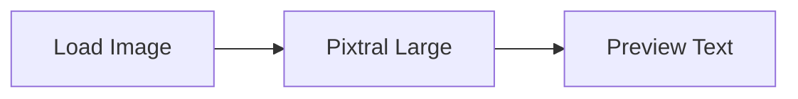
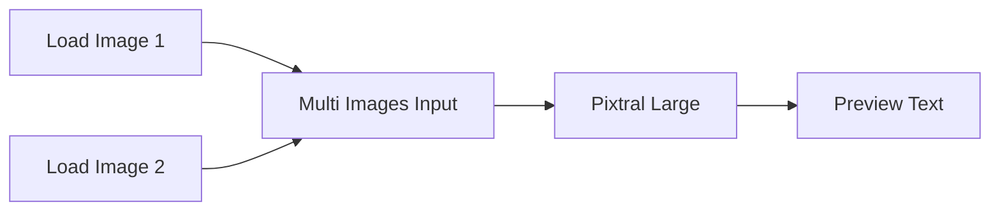
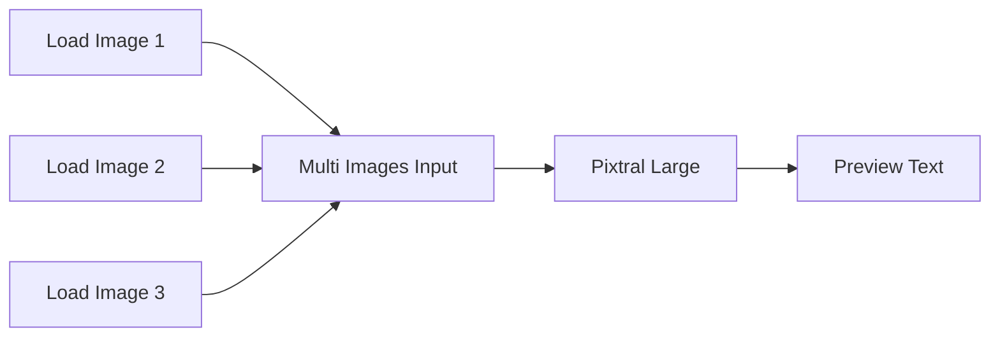

# ComfyUI Pixtral Large Extension

A ComfyUI custom node that integrates Mistral AI's Pixtral Large vision model, enabling powerful multimodal AI capabilities within ComfyUI. Pixtral Large is a 124B parameter model (123B decoder + 1B vision encoder) that can analyze up to 30 high-resolution images simultaneously.


## Features

- 🖼️ Process up to 30 high-resolution images in a single request
- 🧠 Leverages Pixtral Large's 124B parameter architecture
- 📝 Generate detailed descriptions and analysis of images
- 📊 Support for documents, charts, and natural images
- 🌐 128K context window for extensive image processing
- 🔤 Multilingual capabilities including:

  - English
  - Hebrew (עברית)
  - Arabic (العربية)
  - Chinese (中文)
  - Japanese (日本語)
  - Korean (한국어)
  - And many more languages
- 📚 Advanced OCR in multiple languages and scripts
- 🛠️ Customizable parameters for fine-tuned responses

## Installation

1. Clone this repository into your ComfyUI's custom_nodes directory:
```bash
cd ComfyUI/custom_nodes
https://github.com/ShmuelRonen/ComfyUI_pixtral_large.git
```
2. Restart ComfyUI

## Included Nodes

The extension adds three powerful nodes to ComfyUI:

### 1. Pixtral Large
Main node for image analysis using Pixtral Large.

Parameters:
- `prompt`: Your query about the image(s) - can be in any supported language
- `images`: Input images to analyze
- `api_key`: Your Mistral AI API key
- `temperature`: Response randomness (0.0-1.5)
- `maximum_tokens`: Max response length (1-32768)
- `top_p`: Nucleus sampling parameter (0.0-1.0)

Use Cases:
- Image analysis and description
- Document text extraction
- Chart and graph interpretation
- Mathematical reasoning
- Cross-lingual image understanding

### 2. Multi Images Input
Specialized node for combining multiple images into a batch for analysis.

Parameters:
- `inputcount`: Number of image inputs (2-30)
- Dynamic image inputs (generated based on inputcount)
- Optional parameters for each image slot

Features:
- Automatic batch creation
- Support for up to 30 simultaneous images
- Compatible with all ComfyUI image outputs
- Maintains image quality and resolution
- Efficient memory handling

Use Cases:
- Batch document processing
- Multiple page analysis
- Comparative image analysis
- Sequential image storytelling
- Before/after image analysis

### 3. Preview Text
Advanced text output display node for viewing Pixtral Large results.

Parameters:
- `text`: Input text to display (automatically connected to Pixtral Large output)
- Dynamic sizing
- Auto-formatting

Features:
- RTL language support
- Unicode text display
- Formatted output
- Multi-paragraph handling
- Supports all languages
- Copy-paste functionality

Use Cases:
- Displaying analysis results
- Debugging outputs
- Text verification
- Intermediate result inspection
- Documentation generation

## Node Connections and Workflow Examples

### Basic Single Image Analysis


### Multi-Image Analysis


### Complex Document Analysis


## Multilingual Capabilities

Pixtral Large offers robust multilingual support for both input and output:

### Text Recognition (OCR)
- Recognizes text in multiple scripts and languages
- Particularly strong with:
  - Hebrew (עברית) - including modern and historical texts
  - Latin scripts
  - CJK characters (Chinese, Japanese, Korean)
  - Arabic script
  - Cyrillic
  - And more

### Analysis and Response
- Can understand prompts in multiple languages
- Provides responses in the same language as the prompt
- Handles mixed-language content effectively
- Accurate translation and transcription capabilities

### Example Usage
```python
# Hebrew prompt example
prompt = "תאר את התמונה בעברית"

# Mixed language example
prompt = "Analyze this image and provide the response in Hebrew (עברית)"
```

## Getting the free API Key
1. Visit [Mistral AI](https://mistral.ai/) and sign up or log into your account.
2. Navigate to the API section and follow the instructions to generate a new API key.
3. Once you have your API key, enter it into the node configuration as described in the setup instructions.

## Error Handling

Common error messages and solutions:

### Multi Images Input Errors
- "At least 2 images are required": Add more images to input slots
- "Exceeded maximum image count": Reduce number of input images to 30 or less
- "Invalid image format": Ensure images are in supported format

### Pixtral Large Errors
- "API Error": Verify API key and internet connection
- "Invalid prompt": Check prompt formatting
- "Token limit exceeded": Reduce maximum_tokens parameter

### Preview Text Errors
- "Unicode decode error": Check text encoding
- "Display buffer full": Reduce output size

## Contributing

Contributions are welcome! Please feel free to submit a Pull Request.

## License

This project is licensed under the MIT License - see the [LICENSE](LICENSE) file for details.

## Acknowledgments

- Thanks to Mistral AI for providing the Pixtral Large model
- Built for the ComfyUI community

## Version History

- 1.0.0: Initial release
  - Full node suite implementation
  - Multi-image support
  - Multilingual capabilities including Hebrew
  - Advanced text preview features

## Support

If you encounter any issues or have questions:
1. Check the [Issues](https://github.com/yourusername/ComfyUI_pixtral_large/issues) page
2. Create a new issue if needed


